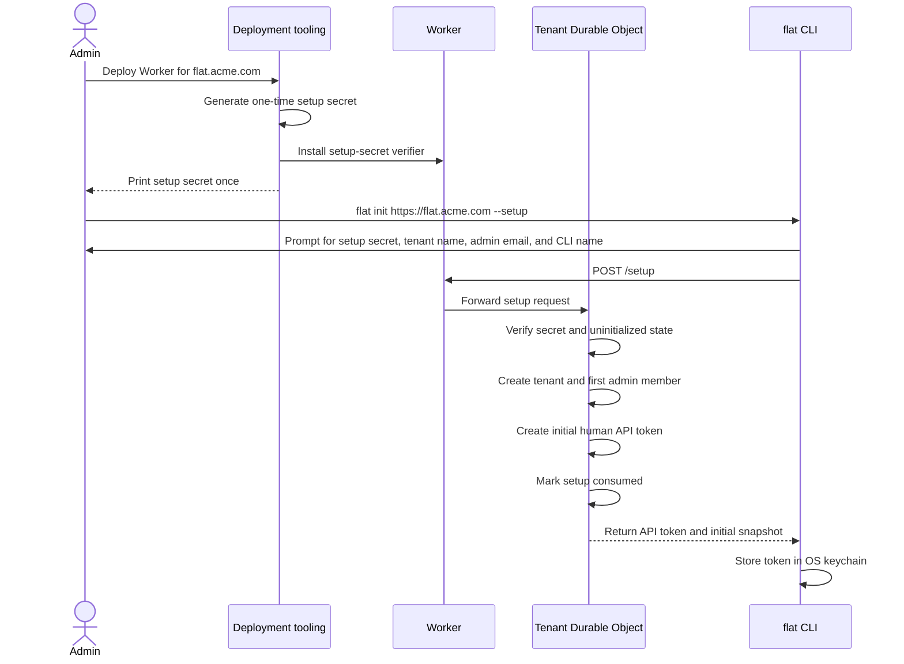
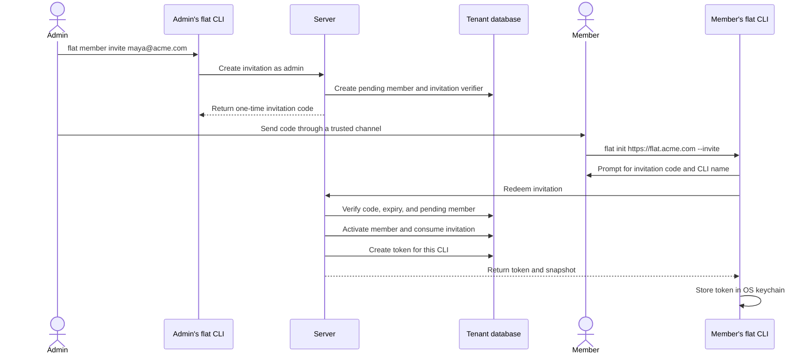
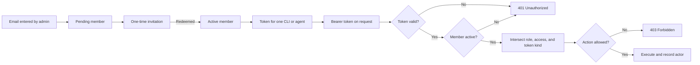

# Authentication, enrollment, and permissions

Status: accepted design. This document extends `001_initial_system.md` and
supersedes its bootstrap and member-enrollment details.

Implementation note: the current milestone covers tenant setup, enrollment,
token/member administration, audit, projects, authorization for the HTTP
ticket-sync surface, comments, server-side search, and server-side MCP.
WebSocket/watch, labels, force push, native keychain storage, and the
operator-recovery deployment procedure remain deferred slices of this accepted
design.

In particular:

- Deployment emits a one-time setup secret, not a permanent admin token.
- `flat member invite` replaces `flat member add` as the normal enrollment
  path.
- Email identifies a member, but possession of a valid token authenticates a
  request.
- Tenant roles and token access levels jointly authorize requests.
- All projects remain visible to every tenant member in v1. Project ownership
  grants management rights, not privacy.
- The single shared `FLAT_TOKEN` deployment secret from the first milestone is
  retired; deployment installs a setup verifier and HMAC keys instead.

## Goals

The permissions system must answer four separate questions:

1. Who may claim a newly deployed tenant?
2. How does a person become a tenant member?
3. How does a CLI or agent authenticate as that member?
4. Which operations may that authenticated principal perform?

It must also preserve trustworthy attribution. A client cannot choose an
arbitrary acting email or `on_behalf_of` value.

## Core model

A Flat deployment hosts exactly one tenant. Deploying the Worker creates an
uninitialized tenant service. The first successful setup request initializes
the tenant and creates its first admin.

The relevant concepts are:

- **Member:** a person identified by an email address and an immutable ULID.
- **Role:** the tenant-level authority granted to a member.
- **Token:** a credential issued to one CLI installation or agent.
- **Token access:** an upper bound on what that token may do.
- **Enrollment:** a one-time credential used to activate, recover, or upgrade a
  member.
- **Invitation:** an enrollment that activates a pending member.
- **Project owner:** a member allowed to manage one project's metadata.

A request's effective permissions are the intersection of the member's role,
the token's access level, and restrictions imposed by the token kind.

```text
effective permissions = role permissions
                      ∩ token access permissions
                      ∩ token-kind permissions
```

All tokens belong to a member. There are no detached service accounts and no
permanent deployment-wide admin tokens.

An enrollment authorizes only its enrollment operation. It never grants work
permissions or access to another member's data.

## Roles

V1 has three tenant roles:

- `admin`: manages tenant membership and all work data.
- `member`: creates and edits normal work data.
- `viewer`: reads tenant work data but cannot change it.

At least one active admin must always exist. The server rejects any operation
that would suspend, remove, or demote the last active admin.

V1 accepts ASCII email addresses. The server trims leading and trailing ASCII
whitespace, then lowercases the full address before validation and storage.
A normalized address must contain exactly one `@`, a non-empty local part, a
domain with at least one `.` separating non-empty labels, and no whitespace or
control characters: `maya@acme.com` passes; `maya@acme`, `@acme.com`, and
`a b@acme.com` fail with `422 invalid_email`. This is a plausibility check,
not RFC 5322 validation, and it proves nothing about mailbox ownership.
The Rust schema library owns normalization and validation, and generated
TypeScript code must use the same test fixtures. Normalized addresses are
unique. The member ULID,
rather than the email string, is used for foreign keys and authorization
checks. Email addresses are immutable in v1. An admin must invite a replacement
member if an address changes.

Members are suspended rather than hard-deleted so old tickets, comments, and
audit records retain valid attribution.

## Permission matrix

| Action | Admin | Member | Viewer |
|---|---:|---:|---:|
| Read snapshot, deltas, tickets, comments, labels, projects, and safe member profiles | Yes | Yes | Yes |
| Search tenant work data | Yes | Yes | Yes |
| List active tenant members | Yes | Yes | Yes |
| Create and edit tickets | Yes | Yes | No |
| Add comments | Yes | Yes | No |
| Create and edit labels | Yes | Yes | No |
| Create projects | Yes | Yes | No |
| Update project metadata | Yes | If project owner | No |
| Manage a project's owner list | Yes | If project owner | No |
| Delete tickets, labels, or projects | Yes | No | No |
| Invite, recover, upgrade, suspend, or reactivate members | Yes | No | No |
| Cancel a pending member | Yes | No | No |
| Change member roles | Yes | No | No |
| View pending invitations | Yes | No | No |
| Revoke another member's tokens | Yes | No | No |
| List and revoke own tokens with a human token | Yes | Yes | Yes |
| Create own tokens with a human token | Up to caller access | Up to caller access | Read only |

The effective member who creates a project becomes its first project owner.
This rule also applies when an agent token creates the project. Project owners
may change the project's display name, description, and owner list. Project
descriptions may contain at most 256 KiB of UTF-8. Project keys remain immutable.
Project owners cannot delete projects unless they are also tenant admins.

Setup creates the default `DEMO` project and makes the claiming admin its
first owner.

Comments are append-only in v1. No role can edit or delete a comment. An owner
may remove any owner, including themselves or the project's final owner. A
project with no owners remains visible and writable through normal ticket
operations. An admin with `write` access may change its metadata, but adding
an owner requires a human `admin` token.
Only active members with role `member` or `admin` may be project owners.

`flat push --force` requires normal write permission. It changes conflict
handling, not authorization. A member may force a write they could have made
without `--force`.

Only active members may receive new ticket assignments. Suspending a member
does not rewrite existing tickets assigned to them, but no new assignments may
be made until the member is reactivated or the ticket is reassigned.

Suspension is a credential reset, not a pause. In the same transaction, the
server revokes all of the member's tokens and live recovery and upgrade
enrollments and removes the member from every project owner list. After commit,
the DO closes sessions for the revoked tokens. Reactivation does not restore
any of those records. After reactivation, an admin creates a recovery
enrollment so the member can obtain a new human token.

The role-demotion transaction revokes tokens whose access exceeds the new role
ceiling and live upgrade enrollments whose intended access exceeds that
ceiling. After commit, the DO closes sessions for the revoked tokens. A later
promotion does not restore those records. The member keeps lower-access tokens
that the new role still permits. Demotion to `viewer` also removes the member
from every project owner list.

Promotion does not raise an existing token's access. When an active member has
an eligible human token and no live upgrade enrollment, raising their role
creates one at the new role ceiling. The member redeems it to raise that token.
Existing tokens and agents keep their current access. If the member has no live
human token, the role change still succeeds and tells the admin to use recovery.
Raising a suspended member's role does not create an upgrade; after
reactivation, recovery issues a token at the new ceiling. A pending member's
intended role changes only through reinviting.

If an active member already has a live upgrade enrollment, the role change
succeeds without changing or replacing it. The response includes the pending
`intended_access`, the new role ceiling, and whether the pending upgrade reaches
that ceiling. If it does not, the response directs the admin to
`flat member upgrade EMAIL --replace`. Promotion and upgrade responses also
report how many live human tokens remain below the new ceiling.

## Project visibility

Every active member, including viewers, can read every project and ticket in
the tenant in v1. Project owners are maintainers, not an access-control list.

This preserves the original architecture:

- `/snapshot` contains the tenant's work data.
- One global sequence orders all mutations.
- `flat sync --watch` follows one tenant stream.
- FTS searches all tenant work data.
- The local mirror can contain every project.

Restricted projects would require permission-aware snapshots, delta filtering,
search filtering, access-revocation events, and local mirror cleanup. They are
deferred with teams and hosted multi-tenancy.

Revoking access prevents future server requests. It cannot erase files that a
client already downloaded.

## Initial tenant setup

Deployment tooling generates a random one-time setup secret. It installs only
a verifier in the Worker configuration and prints the plaintext secret once.
The credential has the prefix `flat_setup_`, followed by at least 256 bits of
randomness encoded as unpadded base64url.

Before setup, normal API, sync, search, and MCP requests return
`setup_required`. The setup endpoint accepts requests only while the tenant DO
is uninitialized.

`POST /setup` requires the setup credential, an admin email, and a tenant
display name. The server trims the display name and accepts 1 to 80 Unicode
scalar values after trimming. An empty trimmed value returns `422
invalid_tenant_name`.



The setup operation is one transaction. It creates:

1. The tenant metadata row.
2. The first active member with role `admin`.
3. A human token with `admin` access for the first admin's CLI.
4. An audit event.
5. A permanent initialized marker.

Once the transaction commits, `/setup` rejects all future requests even if the
original secret is presented. Rotating the configured setup-secret verifier
must not reopen setup.

Possession of the setup secret and deployment access authorizes the initial
admin email. Flat does not separately prove ownership of that mailbox.

Example:

```console
$ flat init https://flat.acme.com --setup
Setup code: ********
Tenant name: Acme
Admin email: gabe@acme.com
CLI name: gabe-macbook

Initialized tenant "Acme"
Authenticated as gabe@acme.com (admin)
Tickets: /Users/gabe/.flat/flat.acme.com
```

If every admin loses their tokens, an operator with access to the company's
Cloudflare account may create a recovery enrollment for an existing active
admin. The deployment command uses this flow:

1. Generate a one-time operator credential with prefix `flat_oprec_` and 256
   bits of randomness encoded as unpadded base64url.
2. Install its verifier in Worker configuration and deploy it.
3. Call `POST /operator/recover` with the secret and the target admin email.
4. Have the tenant DO consume the verifier and run the normal recovery-creation
   transaction with a 15-minute enrollment lifetime.
5. Print the recovery credential once.
6. Remove the verifier from Worker configuration and deploy again.

The DO records the consumed verifier so a failed cleanup cannot make it
reusable. When no operator verifier is configured, `POST /operator/recover`
compares against a dummy verifier and fails with the same `401` as a wrong
secret. The endpoint accepts only active admins as targets. The shared
recovery transaction revokes all of the admin's tokens, revokes older recovery
and upgrade enrollments, creates the new recovery enrollment, and writes an
audit event with actor kind `deployment`. After commit, the DO closes sessions
for the revoked tokens. Recovery does not reset the tenant, change a role, or
reopen `/setup`.

## Member invitations

Admins enroll teammates with `flat member invite`:

```console
$ flat member invite maya@acme.com --role member
Invitation created for maya@acme.com
Expires: 2026-03-14 17:00 UTC

Setup host: https://flat.acme.com
Invitation code: flat_inv_7Jk3...
```

Creating an invitation:

1. Creates a pending member, or reuses an existing pending member.
2. Revokes any previous unconsumed invitation for that member.
3. Generates a random, single-use invitation secret.
4. Stores only the invitation verifier.
5. Records the inviting admin, intended role, creation time, and expiry.
6. Returns the plaintext invitation secret once.

Inviting an active member fails with `member_already_active`. Inviting a
suspended member fails with `member_suspended`; the admin must reactivate that
member and create a recovery enrollment instead. Reinviting a pending member
updates the intended role and revokes the older invitation in the same
transaction.

`flat member ls --pending` lists pending emails, intended roles, inviting
admins, creation times, and expiry times. It never returns invitation secrets
or verifiers. `flat member cancel EMAIL` invalidates and deletes the invitation,
writes an audit event, and deletes the pending member in one transaction.
Pending members may be hard-deleted because they have never owned or authored
work. This is the only exception to the rule that member records are retained.
The audit event keeps the member ID, normalized email, intended role, and
inviting admin, but no credential material.

The default invitation lifetime is 24 hours. Deployments may configure a
shorter lifetime or a maximum of seven days.

Flat does not send email in v1. The admin sends the invitation through company
email, trusted chat, or another secure channel. Possession of the invitation
proves enrollment authority. It does not prove mailbox ownership unless the
admin delivered it through a channel that does so.



Invitation redemption is transactional. The server activates the member,
consumes the invitation, issues the initial human token, and writes an audit
event together. Concurrent redemption attempts can produce only one token.
The token receives the highest access allowed by the new role: `read` for a
viewer, `write` for a member, and `admin` for an admin.

An invitation cannot be redeemed if it is expired, revoked, consumed, or bound
to a suspended or already active member. Admins use `flat member recover` for
an active member who has lost all credentials.

```console
$ flat member recover maya@acme.com
Recovery enrollment created for maya@acme.com
Recovery code: flat_rec_A92f...
```

A recovery enrollment follows the same expiry, hashing, and single-use rules
as an invitation. Only an admin using a human token with `admin` access may
create one through the normal API. The tenant DO uses the same creation
transaction for normal and operator recovery. It revokes the member's existing
tokens, revokes older recovery and upgrade enrollments, creates the new
recovery enrollment, and writes one recovery audit event containing the revoked
token IDs. After commit, the DO closes sessions for the revoked tokens. Normal
recovery records the calling admin as actor; operator recovery records
`deployment`.

Redemption issues a human token at the member's role ceiling. It does not
change the role or reactivate a suspended member.

The member redeems the recovery credential with `flat init HOST --recover`.

### Access upgrades

An upgrade enrollment's `intended_access` is the member's role ceiling when the
server creates it. A later promotion does not change or replace a live
enrollment. When no upgrade is pending and the member has an eligible human
token, raising their role creates one and returns its credential to the admin.
The admin sends it to the member through a trusted channel. Upgrade enrollments
use the invitation expiry limits, hashing rules, and single-use transaction
rules.

Upgrades are sequential. A member may have only one live upgrade enrollment.
`flat member upgrade EMAIL` returns `409 upgrade_already_pending` when one
exists. The admin may pass `--replace` to revoke and replace a lost upgrade
credential. After the member redeems or the admin replaces the live credential,
the admin may create one for another CLI installation. Creation fails unless
the target is active and has at least one live human token below the current
role ceiling.

```console
$ flat token upgrade
Upgrade code: ********
Token access changed from write to admin
Human tokens still below admin access: 1
```

Redemption requires both the upgrade credential and an unrevoked human token
belonging to the target member. The server raises that token to the access
recorded in the enrollment, consumes the enrollment, and writes an audit event
in one transaction. It does not revoke or change any other token. Redemption
fails without consuming the enrollment if the current token already meets or
exceeds the intended access, or if the member's current role no longer permits
the recorded access. Members without a working human token use recovery
instead.

## Why there is no authoritative email file

An email allowlist does not authenticate anyone. A person who types an allowed
email still needs an invitation, API token, magic link, or SSO credential.

A deployment file would also split membership state between configuration and
the tenant database. Removing a member could require a redeploy, runtime role
changes could drift from the file, and the file would not represent pending
invitations or token revocations.

The tenant database is authoritative. Flat may accept a CSV file as bulk input:

```console
$ flat member invite --file members.csv --out invitations.csv
```

```csv
email,role
maya@acme.com,member
lee@acme.com,viewer
```

The CLI requires `--out` for bulk invitations and refuses `--out -`. Before it
sends the request, it creates the output file with mode `0600` and fails if the
path already exists. The server validates every input row before making any
change, then creates all pending members and invitations in one transaction. An
invalid row rejects the full import.

The output CSV contains `email`, `role`, `expires_at`, and `invitation_code`.
The CLI never prints bulk invitation secrets to stdout. It removes the empty
output file when the server rejects the import before returning secrets. If it
cannot finish writing a successful response, it leaves the partial `0600` file
in place and tells the admin to rerun with a new output path. Reimporting
revokes the first set of live invitations before returning new credentials.
The input file does not remain attached to the tenant and does not grant access
by itself.

## Token model

Each CLI installation and agent gets its own token. Users should not share one
long-lived token between laptops, CI jobs, and agents.

Setup, invitation redemption, and recovery redemption require a name for the
new CLI installation. The CLI defaults to the local hostname and lets the user
edit it before submission. If the hostname is not a valid token name, the CLI
requires the user to replace it.

Tokens have two kinds:

- `human`: an interactive CLI installation controlled by the member.
- `agent`: an automated process acting on behalf of the member.

Tokens have one of three access levels:

- `read`: read, sync, watch, and search. A human token at this level may also
  list and revoke its owner's tokens, create another `read` token, and redeem a
  matching upgrade enrollment.
- `write`: `read` plus ticket creation and editing, comment creation, label
  creation and editing, project creation, permitted project metadata changes,
  and force pushes.
- `admin`: `write` plus ticket, label, and project deletes; tenant membership;
  enrollments; audit reads; cross-member token administration; and
  unrestricted project owner changes.

The role and access checks for common actions are:

| Action | Required role or resource right | Required token access | Required token kind |
|---|---|---|---|
| Read work data | Any active role | `read` or higher | Human or agent |
| Write normal work data | Admin or member, with project ownership where required | `write` or higher | Human or agent |
| Delete work data | Admin | `admin` | Human |
| Manage members and enrollments | Admin | `admin` | Human |
| Read the audit log | Admin | `admin` | Human |
| List or revoke own tokens | Any active role | Any | Human |
| Create a token for self | Any active role | New access no higher than caller access or role ceiling | Human |
| Upgrade the current token | Intended access allowed by current role | Any | Human plus upgrade enrollment |
| List or revoke another member's tokens | Admin | `admin` | Human |
| Create an agent token for another member | Admin | `admin` | Human |

The policy module uses stable action names rather than HTTP routes or CLI
commands. V1 defines `work.read`, `work.search`, `ticket.create`,
`ticket.update`, `ticket.delete`, `comment.create`, `label.create`,
`label.update`, `label.delete`, `project.create`, `project.update`,
`project.delete`, `project_owner.update`, `member.list`, `member.invite`,
`member.cancel`, `member.recover`, `member.upgrade`, `member.suspend`,
`member.reactivate`, `member.change_role`, `invitation.list`,
`token.self.list`, `token.self.create`, `token.self.revoke`,
`token.self.upgrade`, `token.other.list`, `token.other.revoke`,
`token.other.create_agent`, and `audit.read`.

The server applies these restrictions:

- `admin` access is valid only for a human token belonging to an admin member.
- Agent tokens may have `read` or `write` access, never `admin`.
- Agent tokens cannot create, inspect, or revoke tokens.
- Human tokens may list and revoke tokens belonging to their own member. This
  includes revoking the token used for the request.
- A human token may create another token for the same member, but the new token
  cannot exceed the caller's access or the member's role ceiling.
- Only a valid upgrade enrollment may raise an existing token's access.
- Role ceilings are `read` for viewers, `write` for members, and `admin` for
  admins. Agent tokens remain capped at `write`.
- Only an admin human token with `admin` access may list metadata or revoke
  tokens belonging to another member. It may not mint a human token as that
  member.

Admins may explicitly create an agent token delegated to another active member:

```console
flat token create \
  --kind agent \
  --for maya@acme.com \
  --name ticket-triage \
  --access write \
  --expires 30d
```

This operation must be explicit and audited. The resulting token cannot exceed
the delegated member's role. The audit event and token metadata retain the
admin who created it. Work made with the token displays that delegation, so it
cannot look like a token Maya created herself. Admins use a recovery
enrollment, not a human token, when helping another person regain CLI access.

`flat token create` defaults to `--kind agent`. Its default access is the lower
of `write` and the member's role ceiling. Human tokens default to the member's
role ceiling. Callers must pass `--kind human` when creating a token for
another interactive CLI installation.

Agent tokens expire after 30 days by default and may not exceed a configurable
90-day maximum. Human token expiry is optional. Deployments may impose a
maximum lifetime on all tokens.

A token secret is displayed once:

```console
$ flat token create --kind agent --name claude --access write
Token: flat_pat_01JZ..._q7m...
Expires: 2026-04-13 09:00 UTC
```

Token listings return metadata only:

```text
id, name, kind, access, member, created_by, issued_via,
created_at, expires_at, last_used_at, revoked_at
```

They never return token verifiers or plaintext secrets.

The server trims token names, then requires this full-string match:

```text
^[A-Za-z0-9][A-Za-z0-9._-]{0,63}$
```

This rule applies to human and agent tokens. It prevents agent names from
injecting Markdown structure into comment headings. An empty or invalid name
returns `422 invalid_token_name`. Names are compared case-insensitively, and
two live tokens for the same member cannot share one. The stored name keeps
the case the user typed for display; only comparisons fold case. Revocation
frees the name for reuse. Token IDs keep audit and historical attribution unambiguous when a
name is reused.

### Agent attribution

An agent token stores:

- The delegated member ULID.
- A short agent name such as `claude` or `ticket-triage`.
- Its access level and expiry.
- The member who created it.

The server derives attribution from those fields. Mutation envelopes and MCP
arguments cannot set or override `actor`, `member_id`, or `on_behalf_of`.

A comment created with Maya's `claude` token renders as:

```text
claude (for maya@acme.com)
```

If Gabe created the token for Maya with `--for`, the same comment renders as:

```text
ticket-triage (for maya@acme.com, delegated by gabe@acme.com)
```

This attribution proves which token Flat accepted and which member the token
could act for. It does not prove that the member personally initiated the
request.

The comment row records the member ULID, token ULID, token kind, agent name, and
delegating member ULID. This safe attribution data appears in snapshots and
deltas, while the token record stays private. Emails shown in files come from
member records, not client input.

## Credential format and storage

Bearer tokens use a public lookup ID and a random secret:

```text
flat_pat_<token-id>_<secret>
```

Invitation, recovery, and upgrade credentials use the same two-part layout
with distinct prefixes:

```text
flat_inv_<invitation-id>_<secret>
flat_rec_<recovery-id>_<secret>
flat_upg_<upgrade-id>_<secret>
```

IDs are 26-character ULIDs in Crockford base32, which contains neither `-`
nor `_`. Secrets use unpadded base64url, whose alphabet includes both.
Parsing is therefore positional, never a split on `_` from the right: match a
known prefix, read exactly 26 characters as the public ID, require one `_`,
and treat the remainder as the secret.

Setup and operator recovery have one configured verifier each, so they do not
need lookup IDs. Their formats are `flat_setup_<secret>` and
`flat_oprec_<secret>`.

The database stores the public ID and a verifier derived with HMAC-SHA-256 and
a deployment secret. The random secret contains at least 256 bits of entropy.
Comparisons are constant-time. Raw credentials must not appear in application
logs, audit-event payloads, analytics, or error reports.

Each verifier stored in the tenant database records a key ID. Deployments keep
a small key ring, use the newest key for new credentials, and retain old keys
while credentials issued under them remain valid. Removing a key revokes every
credential tied to it.

The server cannot migrate an HMAC verifier because it does not retain the
plaintext secret. Tenant operators must coordinate replacement before removing
an old key. Members replace their own tokens while the old key remains active;
admins replace live enrollments and delegated agent tokens. Key removal is an
intentional mass revocation for anything left on that key.

The key ring and the setup and operator-recovery verifiers live in Worker
configuration. The tenant DO reads them from its environment and performs
every verification itself. The Worker never inspects credentials; forwarding
a request is not verification.

For an unknown public ID, the server still computes and compares a dummy HMAC
before returning an error.

### Enrollment credential verification

The server verifies invitation, recovery, and upgrade credentials in this
order:

1. Parse and validate the prefix, public ID, and secret encoding. Reject an
   invalid format with `422 invalid_credential_format`.
2. Look up the public ID. Select the stored verifier and key when it exists, or
   a dummy verifier and valid key when it does not.
3. Compute the HMAC and compare it in constant time before branching on any
   enrollment state field.
4. Return the same `401 invalid_enrollment` response for an unknown ID or wrong
   secret.
5. Only after the secret matches, inspect expiry, consumption, and revocation.
   Return the matching `410` code when one of those states applies.
6. Check the enrollment kind, target member state, and any required
   authenticated principal before running the enrollment transaction.

An expired, consumed, or revoked enrollment presented with the wrong secret
still returns `401 invalid_enrollment`.

The CLI stores credentials in the operating system keychain. If no supported
keychain exists, it may use a user-only file with mode `0600` after warning the
user. `FLAT_TOKEN` supports noninteractive use and is never persisted unless
the user asks the CLI to do so.

Today's deployments install one shared `FLAT_TOKEN` secret through Alchemy and
check it in the Worker. This design retires that deployment secret: the deploy
step stops requiring it and installs the HMAC key ring and setup verifier
instead. The `FLAT_TOKEN` environment variable keeps its name on the CLI side
but changes contents — a per-member bearer token, never a shared deployment
secret.

Setup, operator recovery, invitation, recovery, upgrade, and token values
should be entered through a prompt or environment variable. Putting them
directly in command arguments may expose them through shell history or process
listings.

All credential-bearing traffic requires HTTPS outside local development.

## From email to authorized request



Authentication and authorization happen in this order:

1. Parse the bearer token and locate its public token ID.
2. Verify the secret in constant time. An unknown token ID compares against a
   dummy verifier, as described under credential storage.
3. Reject revoked or expired tokens.
4. Load the member and reject pending or suspended members.
5. Build a server-side principal from the token and member rows.
6. Check the action against role, token access, token kind, and resource.
7. Execute the operation and record the principal in the same transaction.

The server never trusts identity or permission fields supplied by a client.

## Enforcement points

Authorization lives in one server policy module shared by all transports. It
must not be implemented only in CLI command handling.

The tenant DO is the final trust boundary. It verifies the credential and runs
the resource-level policy check before reading or changing tenant data. The
Worker may reject malformed or obviously unauthenticated requests early, but a
principal assembled only in the Worker cannot replace the DO check.

The server checks permissions for:

- Every HTTP endpoint.
- Every mutation inside a `/sync` batch.
- Snapshot and delta reads.
- WebSocket connection establishment and continued use.
- Server-side search.
- Server-side MCP tool calls.
- Token and member administration.

Local filesystem editing is not an authorization boundary. An unauthorized
user can edit any local file, but the server rejects the resulting mutation on
push. One rejected mutation does not prevent authorized mutations for other
entities in the same sync batch from applying.

For each mutation, authorization runs before conflict detection. A caller must
not learn current field values or conflict details for an operation they may
not perform.

Authorization also runs before an idempotent replay returns its stored result.
The `applied_mutations` row stores the effective member, a SHA-256 hash, and
the original result. Sync mutations hash the canonical mutation envelope.
Server-side MCP writes use a `mcp:`-prefixed mutation ID and hash the
canonical `{tool, input}` object instead. `/sync` reports the per-mutation
conflict `reserved_mutation_id` for that prefix and continues other valid
mutations in the batch, so the two hash meanings cannot collide. The hash
excludes the authorization header, bearer token, batch `last_seq`, connection
data, and other transport metadata. The shared schema defines canonical JSON
encoding, including object-key ordering and omitted optional fields, with
matching Rust and TypeScript fixtures.

A replay returns the stored result only when the current principal may still
perform the action, the effective member matches, and the mutation hash
matches. Reuse by another member or with a different mutation returns `409
mutation_id_reused` without the original result. The server does not store
rejected authorization attempts as applied mutations.

Server-side MCP operations read and write the tenant Durable Object directly.
The Durable Object authenticates and authorizes each operation before reading
or changing accepted state; no local mirror or later push participates.

Long-lived WebSocket sessions must not outlive token revocation or member
suspension. The tenant DO closes affected sessions when membership or token
state changes. It rechecks expiry and verifier-key availability when processing
a frame.

Member, enrollment, token, and audit actions use dedicated endpoints. The
general `/sync` mutation envelope does not accept those entity types.

## Sync and sensitive records

Normal snapshots and deltas include safe profiles for active and suspended
members because ticket assignment and attribution require them. A safe profile
contains only the member ULID, email, role, status, creation time, and activation
time. Pending members do not appear in normal sync data. Snapshots and deltas
must not include:

- Token rows or verifiers.
- Enrollment rows or verifiers.
- Pending-member enrollment details.
- Setup-secret state.
- Private admin audit payloads.

Admin commands read those records through dedicated endpoints that return only
safe metadata.

Member, project-owner, and role changes still receive ordered mutation sequence
numbers so active clients update their rendered state consistently. Secret
material never enters the mutation log.

Sequence numbers are cursors, not a promise that every client can see every
number. `/sync` always returns the latest tenant sequence, even when no visible
delta exists after the client's cursor. A secret-only mutation sends active
watchers a watermark frame containing `latest_seq` and no entity data. Clients
advance their cursor on that frame. They request a new snapshot only after an
explicit `resync_required`; a gap by itself does not trigger a resync.

## Data model additions

The exact SQL may change during implementation, but the schema must represent
the following fields and constraints.

These tables ship through the numbered migration runner introduced in
`003_github_pr_webhooks.md`. The two documents share one migration sequence:
`github_deliveries` is migration 1, and the tables here take the next
unclaimed numbers when implemented.

```text
tenant_metadata additions
  display_name
  initialized_at

members
  id                  ULID primary key
  email               normalized unique email
  role                admin | member | viewer; nullable while pending
  status              pending | active | suspended
  invited_by          nullable member ULID
  created_at
  activated_at        nullable
  suspended_at        nullable

project_owners
  project_id          project ULID
  member_id           member ULID
  created_at
  created_by          member ULID
  primary key (project_id, member_id)

enrollments
  id                  ULID primary key
  member_id           member ULID
  kind                invite | recovery | upgrade
  secret_verifier
  verifier_key_id
  intended_role       nullable role
  intended_access     nullable access
  created_by          nullable admin member ULID
  created_by_kind     human | deployment
  created_at
  expires_at
  consumed_at         nullable
  revoked_at          nullable

tokens
  id                  ULID primary key
  member_id           member ULID
  kind                human | agent
  name
  access              read | write | admin
  secret_verifier
  verifier_key_id
  created_by          nullable member ULID
  issued_via          setup | invite | recovery | self | admin_delegation
  created_at
  expires_at          nullable
  last_used_at        nullable
  revoked_at          nullable

applied_mutations additions
  actor_member_id     member ULID
  actor_token_id      token ULID
  mutation_hash
  stored_result

audit_events
  id                  ULID primary key
  seq                 ordered tenant sequence
  action
  actor_member_id     nullable for pre-setup events
  actor_token_id      nullable
  actor_kind          human | agent | enrollment | deployment | webhook
  agent_name          nullable
  target_type
  target_id
  metadata            non-secret JSON
  created_at
```

Database constraints and transaction checks enforce:

- Unique normalized member emails.
- At least one active admin after initialization.
- An invitation targets a pending member, has an intended role, and has no
  intended access.
- A recovery targets an active member and has no intended role or access.
- An upgrade targets an active member, has an intended access level, and has no
  intended role.
- One live enrollment of each kind per member.
- One-time invitation, recovery, and upgrade consumption.
- No admin access on agent tokens.
- Token names match the documented ASCII pattern.
- No duplicate case-insensitive names among a member's live tokens.
- Tokens belong to a member who was active when the server issued the token.
- Project owners belong to the same tenant, are active when added, and have
  role `member` or `admin`.
- Suspension revokes tokens, recoveries, and upgrades and removes project
  ownership in one transaction.
- Role demotion revokes tokens above the new role ceiling.
- Role demotion revokes upgrades above the new role ceiling.
- Demotion to `viewer` removes project ownership.

Token and enrollment tables are never exposed as normal sync entities.

## Audit requirements

Each accepted work or administrative mutation receives one tenant sequence
number. Its audit event references that number and does not allocate another
one. Mutations to secret records still advance the tenant sequence, so normal
sync clients may observe gaps. A gap carries no secret data. Routine
`last_used_at` updates do not receive a sequence number or audit event.

The audit event for every member-initiated work mutation records:

- The effective member.
- The token used.
- Whether the token was human or agent.
- The agent name when applicable.
- The mutation ID and resulting sequence.

Integration-initiated work mutations, such as GitHub webhook closes
(`003_github_pr_webhooks.md`), have no member and no token. Their audit events
record `actor_kind: webhook`, the integration source, and the delivery or
event ID that caused the write. No fake member or system token is minted for
them.

The server also writes audit events for:

- Initial tenant setup.
- Invitation creation, revocation, and redemption.
- Pending-member cancellation.
- Recovery enrollment creation and redemption.
- Upgrade enrollment creation and redemption.
- Member role and status changes.
- Token creation, access upgrades, and revocation.
- Project owner changes.
- Deletes and force pushes.
- Operator recovery through Cloudflare credentials.

Suspension, demotion, and recovery may revoke several tokens or enrollments in
one transaction. Their single parent audit event records the revoked IDs; the
server does not need one child event per row.

Audit metadata must not contain plaintext credentials, request authorization
headers, or ticket bodies.

Audit events are append-only and retained for the life of the tenant in v1.
Only an admin using a human token with `admin` access may read them. The audit
endpoint returns safe metadata and paginates by sequence. Flat has no endpoint
that edits or deletes audit events.

## Error semantics

- `401 Unauthorized`: missing, malformed, unknown, expired, or revoked token;
  pending or suspended member; or a well-formed enrollment credential with an
  unknown ID or incorrect secret.
- `403 Forbidden`: valid principal lacks permission for the requested action.
- `409 Conflict`: tenant setup required, setup already completed, member
  already active, last-admin protection, an invitation targeting a suspended
  member, `upgrade_already_pending`, `token_already_upgraded`, an upgrade no
  longer allowed by the member's role, concurrent enrollment consumption, a
  duplicate live token name, or mutation ID reuse.
- `410 Gone`: invitation, recovery, or upgrade credential expired, consumed,
  or revoked.
- `422 Unprocessable Entity`: invalid role, access level, email, token expiry,
  token name, tenant display name, assignment target, or enrollment credential
  format.

Before setup, normal endpoints return `409 Conflict` with code
`setup_required`.

Error bodies use stable machine-readable codes so the Rust CLI can provide a
specific recovery command.

## CLI changes

The permissions design adds or changes these commands:

```text
flat init HOST --setup [--name NAME]   # claim an uninitialized deployment
flat init HOST --invite [--name NAME]  # redeem invitation interactively
flat init HOST --recover [--name NAME] # redeem recovery interactively
flat init HOST --token                 # configure an existing token interactively

flat member ls [--all|--pending]
flat member invite EMAIL [--role ROLE] [--expires DURATION]
flat member invite --file members.csv --out invitations.csv
flat member cancel EMAIL
flat member recover EMAIL
flat member upgrade EMAIL [--replace]
flat member suspend EMAIL
flat member reactivate EMAIL
flat member role EMAIL ROLE

flat token create --name NAME [--kind human|agent]
                  [--access read|write|admin]
                  [--for EMAIL] [--expires DURATION]
flat token ls [--all]
flat token revoke TOKEN_ID
flat token upgrade

flat delete KEY                        # delete a ticket
flat project ls
flat project show KEY
flat project create KEY --name NAME [--description TEXT]
flat project update KEY [--name NAME] [--description TEXT]
flat project owner add KEY EMAIL
flat project owner remove KEY EMAIL
flat project delete KEY
flat label delete NAME

flat audit ls [--after SEQ]
```

Delete commands follow the action table: they require an admin member using a
human token with `admin` access, so an agent token can never delete.

`flat member ls` shows active members. Its `--all` flag adds suspended members;
both views contain the same safe profiles already present in normal sync data.
Its `--pending` flag is admin-only and cannot be combined with `--all`.

When `flat member role` raises an active member's role and finds an eligible
human token, it prints the one-time upgrade credential created by that
operation. If an upgrade is already pending, it leaves that credential valid
and prints its `intended_access`. It labels the pending upgrade as insufficient
when that access is below the new ceiling and prints the `--replace` command.
If no eligible token exists, it directs the admin to recovery. The command
always reports the number of live human tokens below the new ceiling.
`flat member upgrade` creates another credential without changing the role;
`--replace` explicitly revokes an older pending credential.

```text
Role changed from member to admin
Pending upgrade access: write (insufficient for admin)
Human tokens below admin access: 2
Replace it with: flat member upgrade maya@acme.com --replace
```

`--for EMAIL`, `flat token ls --all`, `flat member ls --pending`, member
cancellation and upgrade creation, and `flat audit ls` require an admin human
token with `admin` access. An admin may not use `--for` to create a human token
for someone else.

Administrative MCP tools are not included in v1. Membership and token
administration go through explicit CLI commands and HTTP endpoints. This keeps
agent tokens away from tenant administration.

## Implementation order

1. Define shared role, token, action, email-normalization, and credential types.
2. Add members, tokens, enrollments, project owners, audit events, and
   idempotency attribution to the schema.
3. Implement transactional `/setup`, credential verification in the tenant DO,
   and the central authorization policy.
4. Enforce the policy on `/snapshot` and `/sync`, including batch isolation,
   idempotent replay, and sequence watermarks. This replaces the shared
   `FLAT_TOKEN` placeholder that the first milestone in `001_initial_system.md`
   shipped with; the permissions work is its own milestone, not a retroactive
   part of that one.
5. Implement invitation, cancellation, recovery, access upgrade, token
   lifecycle, and their CLI commands.
6. Add server-derived attribution and audit records to every mutation path.
7. Keep the implemented policy enforcement on search and server-side MCP, and
   add it to WebSockets. Add expiry, revocation, and key-removal handling for
   every continued-use path.
8. Add bulk invitation import and the operator recovery procedure.

## Acceptance criteria

The permissions milestone is complete when the following tests pass.

### Authentication core

- Only one caller can complete setup under concurrent attempts.
- The setup secret never works after initialization.
- Uninitialized normal endpoints return `409 setup_required` and are not
  treated as transient failures.
- The tenant DO rejects a request that bypasses Worker authentication or lacks
  a valid principal.
- Setup issues an `admin` human token.
- Setup stores and returns the submitted tenant display name.
- Setup rejects a tenant display name that is empty after trimming.
- A human token cannot create a token above its own access or role ceiling.
- A viewer cannot mutate through HTTP, sync, WebSocket, or MCP paths.
- A member cannot perform tenant administration or delete tickets, labels, or
  projects.
- A project owner can update only projects they own.
- An admin cannot demote or suspend the last active admin.
- Comments cannot be edited or deleted through any transport.
- A mixed sync batch applies authorized mutations and rejects unauthorized
  mutations independently.
- A replay made with a replacement token succeeds when the effective member and
  canonical mutation match.
- Reusing a mutation ID with another member or mutation reveals no stored
  result.

### Enrollment and agents

- An invitation can produce only one token.
- Expired, revoked, consumed, malformed, and incorrect enrollment credentials
  fail with their documented status and code.
- An expired, consumed, or revoked enrollment with the wrong secret returns
  `401`, not `410`.
- Canceling a pending member revokes the invitation and frees the normalized
  email for a new invitation.
- Pending-member listings contain safe metadata and no credential material.
- Invitation and recovery issue tokens at the documented access level.
- Token listings include `created_by` and `issued_via` but no verifier or
  plaintext secret.
- Normal and operator recovery use the same tenant-DO transaction. Both revoke
  every old token and older recovery and upgrade enrollments before creating a
  new recovery enrollment, then close sessions for the revoked tokens.
- An upgrade requires the target member's human token and raises only that
  token. It does not revoke or change other tokens.
- A second live upgrade fails unless the admin explicitly replaces the first.
- Promoting a viewer to member and then to admin before redemption leaves the
  original `write` upgrade valid, reports it as insufficient for `admin`, and
  creates an `admin` upgrade only after explicit replacement.
- Presenting an upgrade from a token already at the intended access fails
  without consuming the enrollment.
- An upgrade fails after the member's role drops below its intended access.
- Suspended members cannot use any existing human or agent token.
- Reactivation does not restore revoked tokens, enrollments, or project
  ownership.
- Role demotion revokes tokens and upgrade enrollments above the new ceiling.
  Demotion to `viewer` removes project ownership.
- Historical comments and assignments still render a suspended member's safe
  profile.
- Agent tokens cannot perform admin operations or mint other tokens.
- An agent cannot forge its delegated member or agent name.
- Work from an admin-delegated agent identifies the delegating admin.
- A project created with an agent token makes the effective member its owner.
- A viewer cannot be added as a project owner.
- A member cannot have two live tokens with the same case-insensitive name.
- Token names containing whitespace, `#`, characters outside the documented
  pattern, or more than 64 characters fail with `422 invalid_token_name`.

### Operations

- Revoking a token closes its active WebSocket sessions.
- Secret-only mutations advance `/sync` cursors and send watermark frames
  without exposing secret data or forcing a snapshot.
- Rotating verifier keys keeps credentials on retained keys valid and rejects
  credentials tied to removed keys.
- Bulk invitation validation is all-or-nothing, and the CLI writes credentials
  only to a new `0600` file.
- Operator recovery targets only an active admin, works once, and never reopens
  setup.
- No API, log, mutation delta, or audit event exposes credential secrets.
- Every accepted work mutation records its effective member and token identity.
- Audit events share the operation's sequence and are visible only to an admin
  human token with `admin` access.
